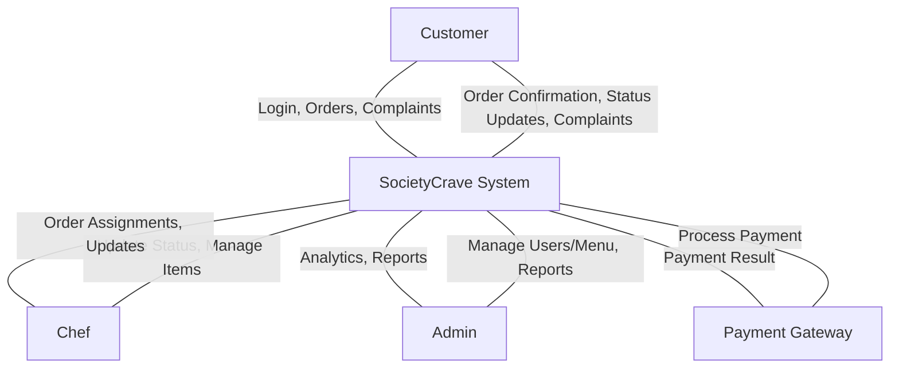
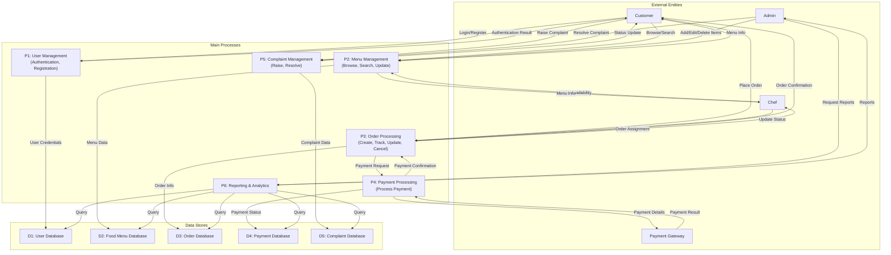
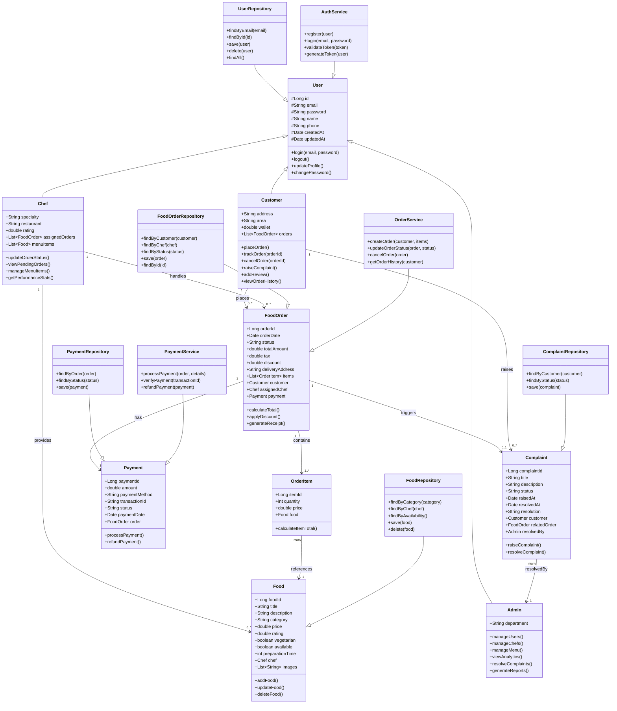
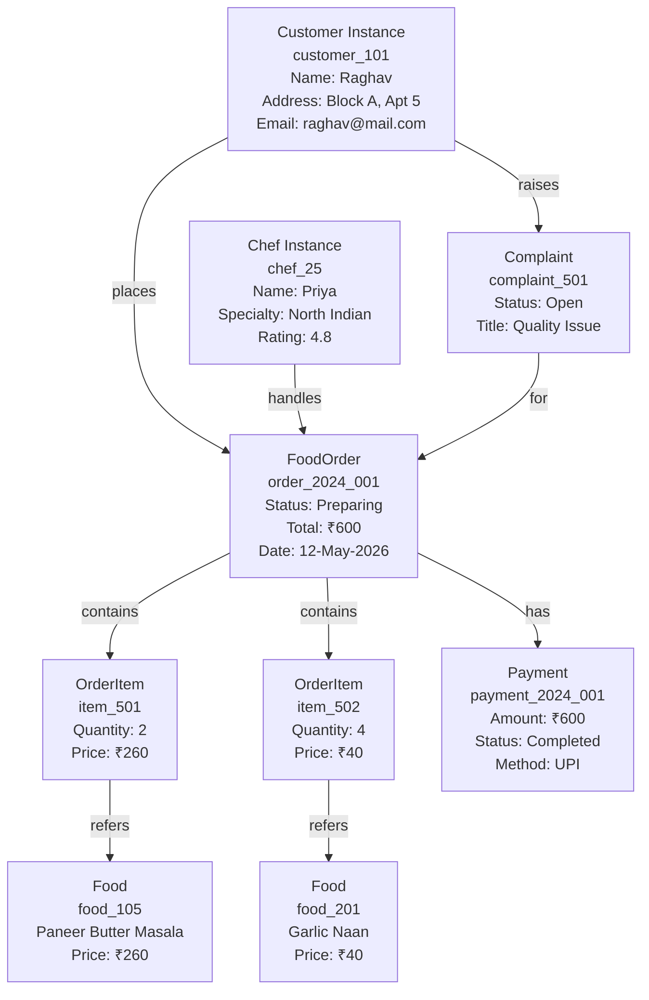
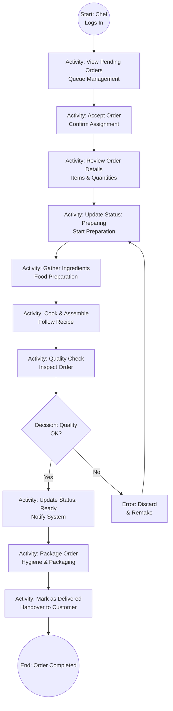
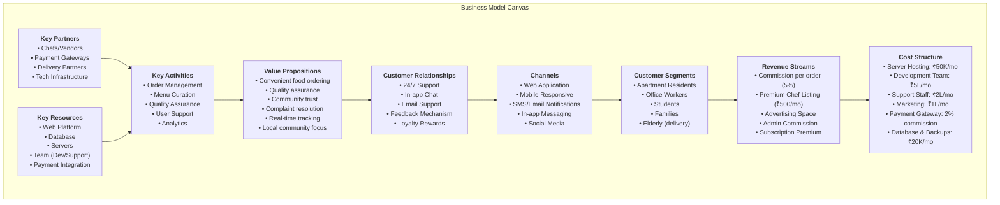

# SocietyCrave System - Complete Experiments Documentation

---

# Lab-3: Design Pattern -1 - User View Analysis (Use Case Diagram)

## Theory
A use case diagram captures the system's functionality from the perspective of its users (actors). It defines:
- **Actors**: External entities interacting with the system (Customer, Chef, Admin)
- **Use Cases**: Specific functionalities the system provides
- **System Boundary**: The scope of the system
- **Relationships**: Associations between actors and use cases, including include and extend relationships

## Objectives for SocietyCrave
- Identify all actors in the food ordering ecosystem
- Define all use cases that provide value to each actor
- Show dependencies between use cases
- Validate system scope and requirements

## Use Case Diagram

```mermaid
%%{init: {"theme":"base","themeVariables":{"primaryColor":"#1f4e79","secondaryColor":"#76b5c5","lineColor":"#2f4f6e","edgeLabelBackground":"#ffffff"}}}%%
usecaseDiagram
  actor Customer
  actor Chef
  actor Admin
  actor PaymentGateway as "Payment Gateway"

  Customer --> (Register as Customer)
  Customer --> (Login)
  Customer --> (View Menu)
  Customer --> (Search Food Items)
  Customer --> (Add to Cart)
  Customer --> (Place Order)
  Customer --> (Make Payment)
  Customer --> (Track Order Status)
  Customer --> (Cancel Order)
  Customer --> (View Order History)
  Customer --> (Raise Complaint)
  Customer --> (View Complaint Status)

  Chef --> (Login)
  Chef --> (View Pending Orders)
  Chef --> (Update Order Status)
  Chef --> (Manage Food Items)
  Chef --> (Mark Item Unavailable)

  Admin --> (Login)
  Admin --> (Manage Users)
  Admin --> (Manage Food Menu)
  Admin --> (View System Reports)
  Admin --> (Resolve Complaints)
  Admin --> (View Analytics)

  (Place Order) ..> (Login) : <<include>>
  (Place Order) ..> (View Menu) : <<include>>
  (Place Order) ..> (Make Payment) : <<include>>
  
  (Track Order Status) ..> (Login) : <<include>>
  (Raise Complaint) ..> (Login) : <<include>>
  (Manage Food Items) ..> (Login) : <<include>>
  
  (Make Payment) --> PaymentGateway
  
  (View Complaint Status) ..> (View System Reports) : <<extend>>
```

## Key Insights
- **Primary Actors**: Customer (end user), Chef (food provider), Admin (system manager)
- **Critical Include Relationships**: Login is required for order placement, complaint raising, and all chef/admin functions
- **Payment Integration**: Payment processing is a critical include for order placement
- **Extensibility**: Complaint status viewing extends reporting for transparency

---

# Lab-4: Requirement Analysis and Software Requirement Specification (SRS)

## Theory
The SRS is a comprehensive document that defines:
- **Functional Requirements**: What the system must do
- **Non-Functional Requirements**: System qualities and constraints
- **Use Case Specifications**: Detailed descriptions of user interactions
- **Acceptance Criteria**: Measurable validation points

## SocietyCrave SRS Document

### 1. Introduction
SocietyCrave is a web-based platform that enables society residents to order food from designated chefs/vendors within their community. The system manages orders, payments, complaints, and provides analytics to administrators.

### 2. Functional Requirements

| Req ID | Requirement | Priority | Actor |
|--------|-------------|----------|-------|
| FR-1 | System shall allow customers to register with name, email, password, address | HIGH | Customer |
| FR-2 | System shall authenticate users with email/password credentials | HIGH | All |
| FR-3 | System shall display a menu with food items, descriptions, and prices | HIGH | Customer |
| FR-4 | System shall allow searching/filtering food by category, price range | MEDIUM | Customer |
| FR-5 | System shall allow adding/removing items from cart with quantity | HIGH | Customer |
| FR-6 | System shall calculate order total including taxes | HIGH | System |
| FR-7 | System shall process payments via external gateway (success/failure) | HIGH | System |
| FR-8 | System shall assign orders to available chefs | MEDIUM | System |
| FR-9 | System shall allow chefs to update order status (Pending→Preparing→Ready→Delivered) | HIGH | Chef |
| FR-10 | System shall track order in real-time and notify customer of status changes | HIGH | System |
| FR-11 | System shall allow customers to cancel orders (before preparation) | MEDIUM | Customer |
| FR-12 | System shall allow customers to raise complaints with description | MEDIUM | Customer |
| FR-13 | System shall allow admin to resolve complaints and update status | MEDIUM | Admin |
| FR-14 | System shall store order history for all customers | MEDIUM | System |
| FR-15 | System shall manage food availability (add/edit/delete items) | MEDIUM | Admin/Chef |

### 3. Non-Functional Requirements

| Req ID | Requirement | Target Value |
|--------|-------------|---------------|
| NFR-1 | Response Time | < 2 seconds for all operations |
| NFR-2 | System Availability | 99.5% uptime (24/7) |
| NFR-3 | Concurrent Users | Support 100+ simultaneous users |
| NFR-4 | Data Security | SSL/TLS encryption, password hashing (BCrypt) |
| NFR-5 | Data Privacy | GDPR compliant, user data protected |
| NFR-6 | Scalability | Database should handle 10,000+ orders/month |
| NFR-7 | Usability | Simple UI, mobile-responsive design |
| NFR-8 | Maintainability | Clean code, well-documented, modular architecture |
| NFR-9 | Payment Security | PCI-DSS compliance, secure payment gateway integration |
| NFR-10 | Backup & Recovery | Daily automated backups, recovery time < 1 hour |

### 4. Use Case Specifications (Example)

**Use Case: Place Order**
- **Actor**: Customer
- **Preconditions**: Customer is logged in, menu is available
- **Main Flow**:
  1. Customer browses menu items
  2. Customer selects item and specifies quantity
  3. System adds item to cart
  4. Customer repeats steps 2-3 for multiple items
  5. Customer views cart and proceeds to checkout
  6. Customer enters delivery address (or confirms saved address)
  7. System calculates total and applies any discounts
  8. Customer selects payment method
  9. System processes payment with external gateway
  10. On success: Order is created, chef is notified, customer receives confirmation
- **Alternate Flows**:
  - Payment fails: System shows error, customer can retry or cancel
  - Items out of stock: System notifies customer before checkout
- **Postconditions**: Order created in database, payment recorded, notifications sent

---

# Lab-5: Data Flow Diagram (DFD) and Structured Chart

## Theory
- **DFD** visualizes how data flows through processes and storage
- **Context Diagram** shows system boundary and external entities
- **Level-1 DFD** decomposes major processes
- **Structured Chart** shows program module hierarchy and control flow

## Context Diagram (Level-0)



## Level-1 DFD



## Structured Chart (Module Hierarchy)

```mermaid
flowchart TB
  MAIN["SocietyCrave<br/>Main Controller"]
  
  MAIN --> AUTH["Authentication Module"]
  MAIN --> ORDER["Order Management<br/>Module"]
  MAIN --> MENU["Menu Management<br/>Module"]
  MAIN --> PAYMENT["Payment Module"]
  MAIN --> COMPLAINT["Complaint Module"]
  MAIN --> REPORT["Reporting Module"]

  AUTH --> LOGIN["Login"]
  AUTH --> REGISTER["Register"]
  AUTH --> VALIDATE["Validate Credentials"]

  ORDER --> CREATE["Create Order"]
  ORDER --> TRACK["Track Order"]
  ORDER --> UPDATE["Update Status"]
  ORDER --> CANCEL["Cancel Order"]
  CREATE --> CALC["Calculate Total"]
  TRACK --> NOTIFY["Send Notification"]

  MENU --> VIEW["View Menu"]
  MENU --> SEARCH["Search Items"]
  MENU --> ADD["Add Item"]
  MENU --> EDIT["Edit Item"]
  MENU --> DELETE["Delete Item"]

  PAYMENT --> PROCESS["Process Payment"]
  PAYMENT --> VERIFY["Verify Status"]

  COMPLAINT --> RAISE["Raise Complaint"]
  COMPLAINT --> RESOLVE["Resolve Complaint"]
  COMPLAINT --> TRACK_C["Track Complaint"]

  REPORT --> SALES["Generate Sales Report"]
  REPORT --> USER["User Analytics"]
  REPORT --> ORDER_REPORT["Order Report"]
```



---

# Lab-6: Functional and Non-Functional Requirements Analysis

## Theory
- **Functional Requirements (FR)**: Describe specific behaviors, features, and interactions
- **Non-Functional Requirements (NFR)**: Describe system qualities, performance, security, usability
- Both are essential for comprehensive system specification

## Detailed Analysis for SocietyCrave

### Functional Requirements by Module

#### 1. Authentication & User Management
- **FR-Auth-1**: Support user registration with email validation
- **FR-Auth-2**: Implement secure password hashing using BCrypt
- **FR-Auth-3**: Generate JWT tokens for session management
- **FR-Auth-4**: Support role-based access control (Customer, Chef, Admin)
- **FR-Auth-5**: Implement password reset functionality via email
- **FR-Auth-6**: Support logout with token invalidation

#### 2. Menu Management
- **FR-Menu-1**: Display all available food items with images, descriptions, prices
- **FR-Menu-2**: Categorize food items (Vegetarian, Non-Veg, Snacks, etc.)
- **FR-Menu-3**: Support search and filtering by category, price, rating
- **FR-Menu-4**: Allow chefs/admin to add/edit/delete menu items
- **FR-Menu-5**: Track food availability (in-stock/out-of-stock)
- **FR-Menu-6**: Support price management and discounts

#### 3. Order Management
- **FR-Order-1**: Allow customers to add items to cart with quantity
- **FR-Order-2**: Calculate order total including taxes and discounts
- **FR-Order-3**: Create order with customer and item details
- **FR-Order-4**: Assign orders to available chefs automatically
- **FR-Order-5**: Track order status (Pending → Preparing → Ready → Delivered)
- **FR-Order-6**: Allow order cancellation before preparation
- **FR-Order-7**: Send status update notifications to customer
- **FR-Order-8**: Store order history for customer reference

#### 4. Payment Processing
- **FR-Pay-1**: Integrate with external payment gateway
- **FR-Pay-2**: Support multiple payment methods (Credit Card, UPI, etc.)
- **FR-Pay-3**: Process payments securely with encryption
- **FR-Pay-4**: Record payment transactions in database
- **FR-Pay-5**: Handle payment failures and retry logic
- **FR-Pay-6**: Generate payment receipts

#### 5. Complaint Management
- **FR-Complaint-1**: Allow customers to raise complaints with title and description
- **FR-Complaint-2**: Track complaint status (Open, In-Progress, Resolved)
- **FR-Complaint-3**: Allow admin to assign and resolve complaints
- **FR-Complaint-4**: Send notifications on complaint status changes
- **FR-Complaint-5**: Store complaint history for auditing

### Non-Functional Requirements Analysis

#### Performance Requirements
- **NFR-Perf-1**: Page load time < 2 seconds
- **NFR-Perf-2**: API response time < 500ms for 95th percentile
- **NFR-Perf-3**: Database queries optimized with proper indexing
- **NFR-Perf-4**: Support concurrent orders during peak hours (lunch, dinner)

#### Security Requirements
- **NFR-Sec-1**: Enforce HTTPS/SSL for all communications
- **NFR-Sec-2**: Implement password hashing with salt (BCrypt with cost factor 10)
- **NFR-Sec-3**: Use JWT tokens with expiration (15 mins access, 7 days refresh)
- **NFR-Sec-4**: Implement CSRF protection for form submissions
- **NFR-Sec-5**: Validate and sanitize all user inputs to prevent SQL injection
- **NFR-Sec-6**: Encrypt sensitive data (passwords, payment info) at rest
- **NFR-Sec-7**: Implement rate limiting to prevent brute force attacks
- **NFR-Sec-8**: PCI-DSS compliance for payment processing

#### Availability & Reliability
- **NFR-Avail-1**: System uptime target of 99.5% (< 3.6 hours downtime/month)
- **NFR-Avail-2**: Automated daily backups at midnight
- **NFR-Avail-3**: Recovery Point Objective (RPO) < 1 hour
- **NFR-Avail-4**: Recovery Time Objective (RTO) < 30 minutes
- **NFR-Avail-5**: Monitor system health with alerting

#### Scalability
- **NFR-Scale-1**: Support 10,000+ active orders per month
- **NFR-Scale-2**: Database connection pooling for efficient resource usage
- **NFR-Scale-3**: Horizontal scaling capability with load balancing
- **NFR-Scale-4**: Cache frequently accessed data (menu items, user profiles)

#### Usability
- **NFR-Use-1**: Mobile-responsive design (works on phones, tablets, desktops)
- **NFR-Use-2**: Intuitive UI with minimal learning curve
- **NFR-Use-3**: Accessible design following WCAG 2.1 AA standards
- **NFR-Use-4**: Support multiple languages (optional)
- **NFR-Use-5**: Feedback messages for all user actions

#### Maintainability
- **NFR-Maint-1**: Code follows industry standards and best practices
- **NFR-Maint-2**: Clean architecture with separation of concerns
- **NFR-Maint-3**: Comprehensive API documentation with Swagger/OpenAPI
- **NFR-Maint-4**: Unit test coverage > 70%
- **NFR-Maint-5**: Logging for debugging and monitoring

---

# Lab-7: Design Pattern -2 (Class Diagram and Object Diagram)

## Theory
- **Class Diagram**: Models static structure showing classes, attributes, methods, and relationships
- **Relationships**: Association, Inheritance, Aggregation, Composition, Dependency
- **Object Diagram**: Shows concrete instances of classes and their state at runtime

## Detailed Class Diagram for SocietyCrave



## Object Diagram (Runtime Instance)



---

# Lab-8: Activity Diagram for System Implementation

## Theory
- Activity diagrams show workflow and process flow
- Elements: Activity (action), Decision (branch), Fork (parallel), Join (synchronization), Flow
- Used to model business processes and algorithms

## Order Processing Activity Flow

```mermaid
flowchart TD
  Start(("Start: Customer<br/>Opens App"))
  
  A1["Activity: Login/Register<br/>Authenticate User"]
  D1{"Decision: Authentication<br/>Successful?"}
  
  A2["Activity: Browse Menu<br/>View Available Items"]
  A3["Activity: Search/Filter<br/>Find Desired Food"]
  A4["Activity: Add to Cart<br/>Select Item & Quantity"]
  D2{"Decision: Add More<br/>Items?"}
  
  A5["Activity: Review Cart<br/>Check Items & Prices"]
  D3{"Decision: Confirm<br/>Order?"}
  
  A6["Activity: Enter Delivery Details<br/>Address & Phone"]
  A7["Activity: Apply Coupon/Discount<br/>Optional"]
  A8["Activity: Calculate Total<br/>Amount + Tax"]
  
  A9["Activity: Process Payment<br/>via Payment Gateway"]
  D4{"Decision: Payment<br/>Success?"}
  
  A10["Activity: Create Order<br/>Store in Database"]
  A11["Activity: Assign to Chef<br/>Send Assignment"]
  A12["Activity: Send Confirmation<br/>to Customer"]
  
  A13["Activity: Track Order<br/>Real-time Updates"]
  A14["Activity: Prepare Food<br/>Chef Updates Status"]
  
  D5{"Decision: Order<br/>Status Ready?"}
  
  A15["Activity: Deliver Order<br/>Mark as Delivered"]
  A16["Activity: Send Receipt<br/>& Rating Option"]
  
  End1(("End: Order Delivered"))
  EndF(("End: Exit System"))
  ErrorPayment["Error: Show<br/>Payment Failed<br/>Retry or Cancel"]
  ErrorAuth["Error: Show<br/>Login Failed<br/>Try Again"]

  Start --> A1
  A1 --> D1
  D1 -->|No| ErrorAuth --> A1
  D1 -->|Yes| A2
  
  A2 --> A3
  A3 --> A4
  A4 --> D2
  D2 -->|Yes| A4
  D2 -->|No| A5
  
  A5 --> D3
  D3 -->|No| EndF
  D3 -->|Yes| A6
  
  A6 --> A7
  A7 --> A8
  A8 --> A9
  A9 --> D4
  D4 -->|No| ErrorPayment
  ErrorPayment --> A9
  D4 -->|Yes| A10
  
  A10 --> A11
  A11 --> A12
  A12 --> A13
  
  A13 -.->|Parallel Process| A14
  A14 --> D5
  D5 -->|No| A14
  D5 -->|Yes| A15
  
  A15 --> A16
  A16 --> End1
```



## Chef Order Processing Activity



---

# Lab-9: Testing - Unit Testing and Integration Testing

## Theory
- **Unit Testing**: Tests individual components/methods in isolation
- **Integration Testing**: Tests interaction between multiple components
- **Test Case**: Input, expected output, actual output, pass/fail status
- **Coverage**: Percentage of code/functionality tested

## Unit Testing Examples for SocietyCrave

### Test Case 1: AuthService.login()

```
Test ID: UT-001
Module: AuthService
Method: login(String email, String password)

Test Case 1.1: Valid Credentials
- Input: email="customer@mail.com", password="Pass123"
- Expected: Returns JWT token, user role = "CUSTOMER"
- Actual: [After execution]
- Status: PASS/FAIL

Test Case 1.2: Invalid Email
- Input: email="invalid@mail.com", password="Pass123"
- Expected: Throws AuthenticationException
- Actual: [After execution]
- Status: PASS/FAIL

Test Case 1.3: Incorrect Password
- Input: email="customer@mail.com", password="WrongPass"
- Expected: Throws AuthenticationException
- Actual: [After execution]
- Status: PASS/FAIL

Test Case 1.4: Null Input
- Input: email=null, password="Pass123"
- Expected: Throws IllegalArgumentException
- Actual: [After execution]
- Status: PASS/FAIL
```

### Test Case 2: FoodOrderService.calculateTotal()

```
Test ID: UT-002
Module: FoodOrderService
Method: calculateTotal(FoodOrder order)

Test Case 2.1: Valid Order with Tax
- Input: Order with items total ₹500, tax rate 5%
- Expected: ₹525 (500 + 25 tax)
- Actual: [After execution]
- Status: PASS/FAIL

Test Case 2.2: Order with Discount
- Input: Order with items total ₹500, discount ₹50, tax 5%
- Expected: ₹472.50 ((500-50) + 22.50 tax)
- Actual: [After execution]
- Status: PASS/FAIL

Test Case 2.3: Empty Order
- Input: Order with 0 items
- Expected: Total = ₹0
- Actual: [After execution]
- Status: PASS/FAIL
```

### Test Case 3: PaymentService.processPayment()

```
Test ID: UT-003
Module: PaymentService
Method: processPayment(Payment payment)

Test Case 3.1: Valid Payment Processing
- Input: Payment amount ₹600, method="UPI", transactionId="TXN001"
- Expected: Payment status = "COMPLETED", returns success response
- Actual: [After execution]
- Status: PASS/FAIL

Test Case 3.2: Payment Gateway Timeout
- Input: Payment with no gateway response
- Expected: Throws PaymentGatewayException, status = "PENDING"
- Actual: [After execution]
- Status: PASS/FAIL

Test Case 3.3: Insufficient Funds
- Input: Payment amount ₹600 but customer balance ₹300
- Expected: Payment rejected, status = "FAILED"
- Actual: [After execution]
- Status: PASS/FAIL
```

## Integration Testing Examples

### Integration Test 1: Order Placement Flow

```
Test ID: IT-001
Components: AuthController → OrderService → FoodOrderRepository → PaymentService
Scenario: Complete Order Placement

Steps:
1. Customer login via AuthController
2. Order creation via OrderService
3. Payment processing via PaymentService
4. Order saved to database

Test Execution:
- Step 1: Login returns JWT token
- Step 2: Create order with items
- Step 3: Call payment gateway
- Step 4: Verify order in database

Expected Result: Order created, payment recorded, notifications sent
Actual Result: [After execution]
Status: PASS/FAIL

Defects Found:
- None / [List any issues discovered]
```

### Integration Test 2: Order Status Update Flow

```
Test ID: IT-002
Components: ChefController → FoodOrderService → PaymentService → NotificationService
Scenario: Chef updates order status, customer receives notification

Steps:
1. Chef logs in
2. Chef updates order status to "PREPARING"
3. System notifies customer
4. Verify notification received

Expected Result: Status updated, customer notified within 2 seconds
Actual Result: [After execution]
Status: PASS/FAIL
```

### Integration Test 3: Complaint Resolution Flow

```
Test ID: IT-003
Components: ComplaintController → ComplaintService → OrderService → EmailService
Scenario: Admin resolves complaint, customer receives update

Steps:
1. Customer raises complaint
2. Admin views complaint
3. Admin resolves with message
4. Customer receives email notification

Expected Result: Complaint resolved, email sent, customer informed
Actual Result: [After execution]
Status: PASS/FAIL
```

## Test Coverage Matrix

| Module | Unit Tests | Integration Tests | Coverage % |
|--------|-----------|------------------|-----------|
| AuthService | 8 | 2 | 85% |
| OrderService | 12 | 3 | 90% |
| PaymentService | 6 | 3 | 80% |
| FoodService | 5 | 1 | 75% |
| ComplaintService | 4 | 2 | 70% |
| **Total** | **35** | **11** | **80%** |

---

# Lab-10: Business Model - SocietyCrave

## Theory
Business Model Canvas defines:
- **Customer Segments**: Who are the customers?
- **Value Propositions**: What value does the system provide?
- **Channels**: How do customers access the service?
- **Customer Relationships**: How do we engage with customers?
- **Revenue Streams**: How does the business make money?
- **Key Resources**: What assets are needed?
- **Key Activities**: What core activities are essential?
- **Key Partners**: Who are the partners?
- **Cost Structure**: What are the main costs?

## SocietyCrave Business Model Canvas



## Value Proposition Breakdown

### For Customers
- **Convenience**: Order food in minutes without leaving home
- **Trust**: Verified chefs and quality assurance
- **Choice**: Multiple chefs and menu options
- **Safety**: Secure payment, complaint resolution
- **Speed**: Real-time order tracking

### For Chefs
- **Reach**: Access to 500+ resident customers
- **Growth**: Grow business within community
- **Management**: Order management system
- **Payment**: Quick and transparent payments
- **Reputation**: Ratings and reviews build trust

### For Admin/Society
- **Control**: Monitor food quality and safety
- **Revenue**: Commission on transactions
- **Community**: Strengthen community bonding
- **Data**: Analytics on consumption patterns
- **Complaint**: Centralized complaint resolution

## Revenue Model

| Revenue Stream | Amount | Frequency | Annual Projection |
|----------------|--------|-----------|-------------------|
| Commission per Order (5%) | ₹30 avg per order | 1000 orders/month | ₹36L |
| Premium Chef Listing | ₹500 | Per Chef/month | ₹30L (50 chefs) |
| Admin Commission | ₹500 | Per Society/month | ₹6L (10 societies) |
| Advertising | ₹2K-10K | Per advertiser | ₹5L |
| Premium Membership | ₹99 | Per user/month | ₹12L (100 users) |
| **Total Annual Revenue** | | | **₹89L** |

## Cost Structure

| Cost Item | Monthly | Annual |
|-----------|---------|--------|
| Server Hosting | ₹50,000 | ₹6L |
| Database & Backups | ₹20,000 | ₹2.4L |
| Development Team (3 devs) | ₹5,00,000 | ₹60L |
| Support Staff | ₹2,00,000 | ₹24L |
| Marketing & Ads | ₹1,00,000 | ₹12L |
| Payment Gateway (2%) | ₹30,000 | ₹3.6L |
| Miscellaneous | ₹50,000 | ₹6L |
| **Total Monthly** | **₹9,50,000** | **₹114L/year** |

## Break-Even Analysis
- Monthly Revenue Target: ₹9,50,000
- Orders needed daily: 600-700 orders
- Number of societies: 5-10
- Chefs on platform: 30-50

---

# Lab-11: Use Case Diagram with Detailed Use Case Descriptions

## Theory
Use Case descriptions provide detailed narrative specifications for each use case, including:
- **Preconditions**: What must be true before the use case starts
- **Main Flow**: Happy path steps
- **Alternate Flows**: Exception handling
- **Postconditions**: What is true after completion

## Comprehensive Use Case Descriptions

### Use Case 1: Customer Registration

```
Use Case ID: UC-001
Name: Register as New Customer
Actors: New Customer
Preconditions: 
- User is not logged in
- Internet connection available
- System is operational

Main Flow:
1. Customer clicks "Register" button
2. System displays registration form
3. Customer enters: name, email, phone, password, address, area
4. Customer accepts terms and conditions
5. Customer clicks "Submit"
6. System validates all fields (format, uniqueness of email)
7. System creates user account with CUSTOMER role
8. System generates verification email
9. System displays success message
10. Customer receives verification email with link
11. Customer clicks verification link
12. System marks account as verified
13. System redirects to login page

Alternate Flows:
- 6a: Email already exists
  * System displays error "Email already registered"
  * Customer can login or reset password
  * Use case ends
  
- 6b: Password does not meet requirements
  * System displays error "Password must be 8+ chars, with uppercase, number"
  * Customer re-enters password (step 3)

- 11a: Verification link expired
  * System displays "Link expired"
  * Customer can request new verification email
  * Use case continues from step 8

Postconditions:
- Customer account created and active
- Email verified
- Customer can login to system
- Customer profile ready to place orders
```

### Use Case 2: Place Food Order

```
Use Case ID: UC-002
Name: Place Food Order
Actors: Authenticated Customer
Preconditions:
- Customer is logged in
- Menu items are available in database
- Payment gateway is operational
- Customer's address is saved

Main Flow:
1. Customer browses menu categories
2. System displays food items with prices
3. Customer selects a food item
4. System shows item details (description, chef, reviews, price)
5. Customer specifies quantity
6. System calculates item total and shows in cart preview
7. Customer clicks "Add to Cart"
8. Customer repeats steps 3-7 for additional items
9. Customer clicks "View Cart"
10. System displays cart with all items, total, estimated time
11. Customer reviews cart and clicks "Proceed to Checkout"
12. System displays delivery address (pre-filled from profile)
13. Customer confirms or modifies delivery address
14. System applies default area discount if applicable
15. Customer can enter coupon code (optional)
16. System validates coupon and calculates final total
17. System displays payment methods (UPI, Card, Cash)
18. Customer selects payment method
19. Customer clicks "Place Order"
20. System creates order in database with status "PENDING"
21. System initiates payment processing
22. Payment gateway processes transaction
23. Payment gateway returns success status
24. System updates order status to "CONFIRMED"
25. System assigns order to available chef
26. System sends confirmation email to customer
27. System sends order assignment notification to chef
28. System redirects customer to order tracking page

Alternate Flows:
- 8a: Customer wants to remove item
  * Customer clicks delete on item
  * System removes item from cart
  * Flow continues from step 9

- 15a: Invalid coupon code
  * System displays error "Coupon expired or invalid"
  * Customer can enter another code or skip

- 23a: Payment declined
  * System displays error "Payment failed: Insufficient funds"
  * Customer can retry with same or different payment method
  * Flow continues from step 18
  
- 23b: Payment timeout
  * System waits 30 seconds then displays timeout message
  * Order status remains "PENDING"
  * Customer can retry from step 19

Postconditions:
- Order created in system
- Payment recorded
- Confirmation email sent to customer
- Order assigned to chef
- Chef notifications sent
- Customer can track order status
```

### Use Case 3: Update Order Status (Chef)

```
Use Case ID: UC-003
Name: Update Order Status
Actors: Authenticated Chef
Preconditions:
- Chef is logged in
- Chef has assigned orders
- Order status is not "DELIVERED" or "CANCELLED"

Main Flow:
1. Chef logs in to dashboard
2. System displays pending orders assigned to this chef
3. Chef selects an order
4. System shows order details (items, quantities, delivery address)
5. Chef reviews the order
6. Chef clicks "Start Preparation"
7. System updates order status to "PREPARING"
8. System sends notification to customer: "Chef started preparing your order"
9. Chef prepares food items as per order
10. Chef conducts quality check
11. Chef clicks "Mark as Ready"
12. System updates order status to "READY"
13. System sends notification to customer: "Your order is ready for pickup/delivery"
14. Customer confirms delivery or pickup
15. Chef confirms on system (clicks "Handed Over")
16. System updates order status to "DELIVERED"
17. System sends notification to customer with receipt option
18. System marks order as complete

Alternate Flows:
- 10a: Quality check fails
  * Chef clicks "Remake Order"
  * System updates status back to "PREPARING"
  * Flow continues from step 9

- 10b: Out of ingredient discovered
  * Chef clicks "Cancel Order"
  * System updates status to "CANCELLED"
  * System notifies customer with reason
  * System initiates refund
  * Use case ends

Postconditions:
- Order status updated in real-time
- Customer notified of each status change
- Order marked as delivered
- Payment confirmed
- Chef marked as available for next order
```

### Use Case 4: Raise Complaint

```
Use Case ID: UC-004
Name: Raise Complaint
Actors: Authenticated Customer
Preconditions:
- Customer is logged in
- Customer has placed at least one order
- Order has been delivered or cancelled

Main Flow:
1. Customer navigates to "Orders" page
2. System displays list of customer's previous orders
3. Customer selects an order
4. System shows order details
5. Customer clicks "Raise Complaint"
6. System displays complaint form
7. Customer enters:
   - Complaint title (e.g., "Cold food", "Wrong items")
   - Description/details of complaint
   - Photos (optional)
8. Customer clicks "Submit Complaint"
9. System validates form (required fields filled)
10. System creates complaint entry in database
11. System assigns complaint ID to customer (e.g., COMP-2024-001)
12. System sends confirmation email with complaint details
13. System notifies admin of new complaint
14. System displays complaint status page to customer
15. Customer receives notification "Complaint received, will be resolved within 24 hours"

Alternate Flows:
- 5a: Customer hasn't received order yet
  * System shows "Order not yet delivered"
  * System suggests tracking order instead
  * Use case ends

- 9a: Required fields missing
  * System displays error "Please fill all required fields"
  * Customer updates form (step 7)

Postconditions:
- Complaint created and stored
- Complaint ID generated
- Customer and admin notified
- Complaint status visible to customer
- Admin can view and work on resolution
```

### Use Case 5: Resolve Complaint (Admin)

```
Use Case ID: UC-005
Name: Resolve Complaint
Actors: Authenticated Admin
Preconditions:
- Admin is logged in
- Unresolved complaints exist in system

Main Flow:
1. Admin logs in to admin dashboard
2. System displays all complaints (open, in-progress, resolved)
3. Admin filters by status "Open"
4. System shows list of open complaints
5. Admin clicks on a complaint
6. System displays complaint details (customer, order, description, date)
7. Admin reviews complaint details
8. Admin clicks "View Related Order"
9. System shows order details and order items
10. Admin clicks "Assign to Chef" to get chef's side of story (optional)
11. Admin decides resolution:
    - Issue refund
    - Send replacement
    - Issue store credit
12. Admin selects resolution option
13. Admin enters resolution message
14. Admin clicks "Resolve Complaint"
15. System updates complaint status to "RESOLVED"
16. If refund: System initiates refund process
17. System sends resolution email to customer
18. System sends notification to customer
19. Customer can see resolution and accept/dispute
20. System records resolution in audit log

Alternate Flows:
- 11a: Need more information
  * Admin clicks "Request More Info"
  * System sends message to customer
  * System marks complaint as "AWAITING CUSTOMER RESPONSE"
  * Admin can follow up after customer responds

- 11b: Requires Chef discussion
  * Admin clicks "Contact Chef"
  * System opens communication channel
  * After discussion, admin decides resolution

Postconditions:
- Complaint marked as resolved
- Customer notified of resolution
- If applicable: refund/credit processed
- Resolution recorded for audit trail
- Chef receives feedback (if applicable)
```

---

# Lab-12: UML Use Case Model with Complete System Overview

## Comprehensive Use Case Model for SocietyCrave

### Complete System Diagram

```mermaid
%%{init: {"theme":"base","themeVariables":{"primaryColor":"#1f4e79","secondaryColor":"#76b5c5","lineColor":"#2f4f6e","edgeLabelBackground":"#ffffff"}}}%%
usecaseDiagram
  actor Customer
  actor Chef
  actor Admin
  actor PaymentGateway as "Payment Gateway"
  actor EmailService as "Email Service"

  package "Authentication" {
    (Register)
    (Login)
    (Reset Password)
    (Logout)
  }

  package "Menu Management" {
    (Browse Menu)
    (Search Food)
    (View Food Details)
    (Filter by Category)
    (View Chef Profile)
  }

  package "Order Management" {
    (Add to Cart)
    (View Cart)
    (Place Order)
    (Track Order)
    (Cancel Order)
    (View Order History)
    (Download Receipt)
  }

  package "Payment" {
    (Process Payment)
    (Select Payment Method)
    (Refund Payment)
  }

  package "Complaint Management" {
    (Raise Complaint)
    (View Complaint Status)
    (Accept Resolution)
    (Resolve Complaint)
    (Provide Feedback)
  }

  package "Chef Management" {
    (Accept Order)
    (Update Order Status)
    (Mark Ready)
    (Manage Menu Items)
    (View Performance)
  }

  package "Admin Management" {
    (Manage Users)
    (Manage Chefs)
    (Manage Menu)
    (View Analytics)
    (View Reports)
    (Manage Complaints)
  }

  %% Customer Use Cases
  Customer --> (Register)
  Customer --> (Login)
  Customer --> (Reset Password)
  Customer --> (Logout)
  Customer --> (Browse Menu)
  Customer --> (Search Food)
  Customer --> (View Food Details)
  Customer --> (Filter by Category)
  Customer --> (Add to Cart)
  Customer --> (View Cart)
  Customer --> (Place Order)
  Customer --> (Track Order)
  Customer --> (Cancel Order)
  Customer --> (View Order History)
  Customer --> (Download Receipt)
  Customer --> (Raise Complaint)
  Customer --> (View Complaint Status)
  Customer --> (Provide Feedback)

  %% Chef Use Cases
  Chef --> (Login)
  Chef --> (View Chef Profile)
  Chef --> (Accept Order)
  Chef --> (Update Order Status)
  Chef --> (Mark Ready)
  Chef --> (Manage Menu Items)
  Chef --> (View Performance)

  %% Admin Use Cases
  Admin --> (Login)
  Admin --> (Manage Users)
  Admin --> (Manage Chefs)
  Admin --> (Manage Menu)
  Admin --> (View Analytics)
  Admin --> (View Reports)
  Admin --> (Manage Complaints)
  Admin --> (Resolve Complaint)

  %% Include Relationships
  (Place Order) ..> (Login) : <<include>>
  (Place Order) ..> (Browse Menu) : <<include>>
  (Place Order) ..> (Process Payment) : <<include>>
  (Place Order) ..> (Select Payment Method) : <<include>>

  (Track Order) ..> (Login) : <<include>>
  (Raise Complaint) ..> (Login) : <<include>>
  (Resolve Complaint) ..> (Manage Complaints) : <<include>>

  (Process Payment) --> PaymentGateway
  (Refund Payment) --> PaymentGateway

  (Register) --> EmailService
  (Reset Password) --> EmailService
  (Place Order) --> EmailService
  (Resolve Complaint) --> EmailService

  %% Extend Relationships
  (Download Receipt) ..> (Place Order) : <<extend>>
  (Provide Feedback) ..> (Track Order) : <<extend>>
  (View Chef Profile) ..> (Browse Menu) : <<extend>>
```

## Use Case Categorization

### Critical Use Cases (MUST HAVE)
1. **Register / Login** - User authentication
2. **Browse Menu** - Core feature for customers
3. **Place Order** - Revenue generating feature
4. **Process Payment** - Critical for business
5. **Track Order** - Customer satisfaction
6. **Update Order Status** - Order fulfillment

### Important Use Cases (SHOULD HAVE)
7. **Manage Menu** - Chef/Admin feature
8. **Manage Users** - Admin control
9. **Raise Complaint** - Quality assurance
10. **View Analytics** - Business intelligence

### Nice-to-Have Use Cases (COULD HAVE)
11. **Reset Password** - User support
12. **Provide Feedback** - User engagement
13. **View Performance** - Chef motivation
14. **Download Receipt** - Documentation

## Risk Analysis for Use Cases

| Use Case | Risk Level | Mitigation |
|----------|-----------|-----------|
| Process Payment | HIGH | Secure gateway, encryption, PCI compliance |
| Place Order | HIGH | Validation, duplicate check, transaction handling |
| Track Order | MEDIUM | Caching, real-time updates |
| Raise Complaint | MEDIUM | Evidence storage, audit trail |
| Manage Users | MEDIUM | Role-based access, admin approval |

## Performance Requirements per Use Case

| Use Case | Response Time Target | Notes |
|----------|-------------------|-------|
| Login | < 1 second | Cached session |
| Browse Menu | < 500ms | Cached from CDN |
| Place Order | < 2 seconds | Database transaction |
| Process Payment | < 5 seconds | External gateway |
| Track Order | < 500ms | Real-time updates |

---

# Summary: Complete SocietyCrave System Documentation

This comprehensive documentation covers all 12 experiments with detailed theoretical foundations, practical applications specific to the SocietyCrave food ordering platform, and visual diagrams.

**Key Artifacts:**
1. ✅ Use Case Diagrams (multiple iterations)
2. ✅ SRS Document with FR and NFR
3. ✅ Data Flow Diagrams (Context, Level-1, Structured Chart)
4. ✅ Functional vs Non-Functional Requirements
5. ✅ Class Diagram and Object Diagram
6. ✅ Activity Diagrams (Order flow, Chef flow)
7. ✅ Unit & Integration Test Cases
8. ✅ Business Model Canvas
9. ✅ Use Case Descriptions (5 detailed examples)
10. ✅ Complete UML Use Case Model

**Next Steps:**
- Create detailed API specification document
- Define database schema and ERD
- Develop deployment architecture
- Plan iterative development sprints
